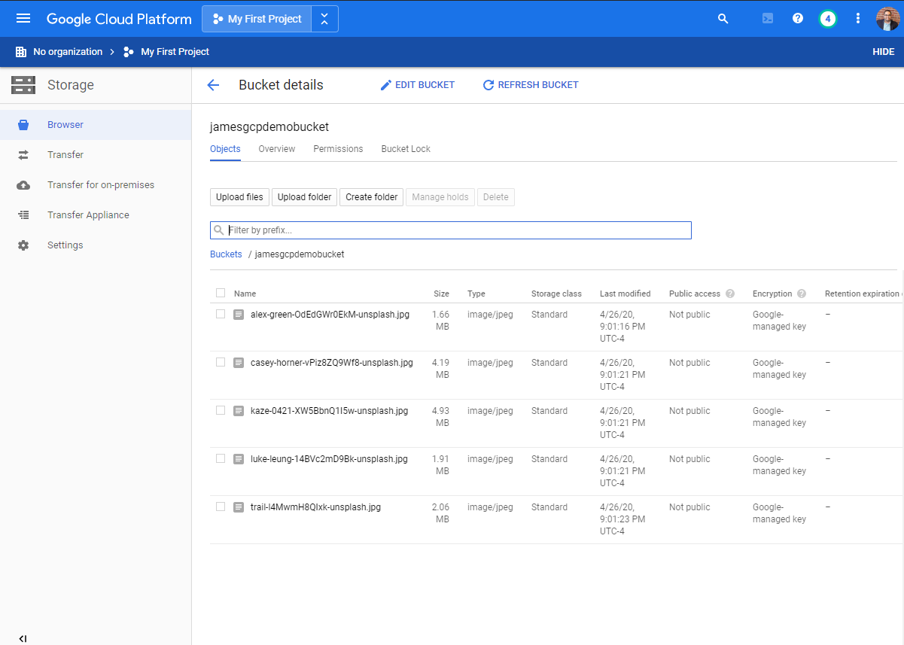
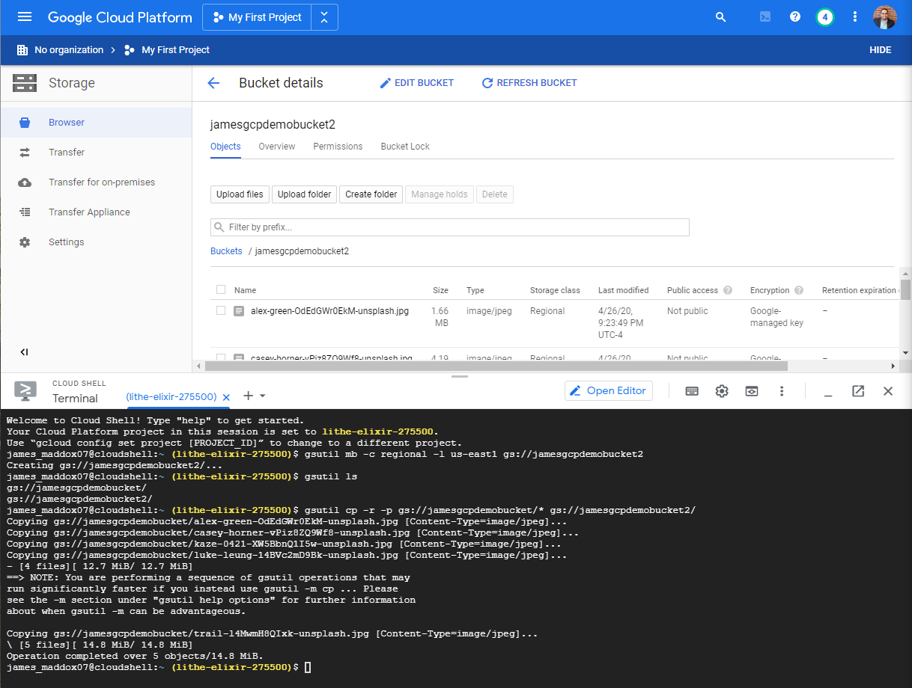
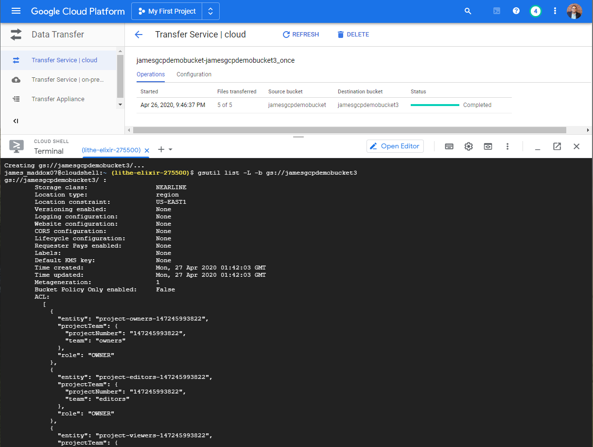
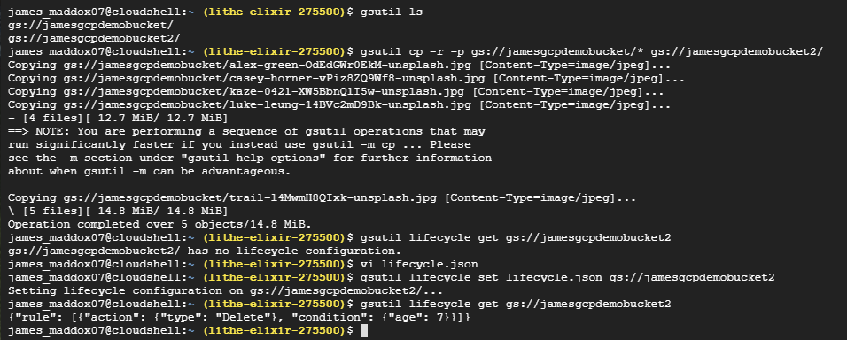
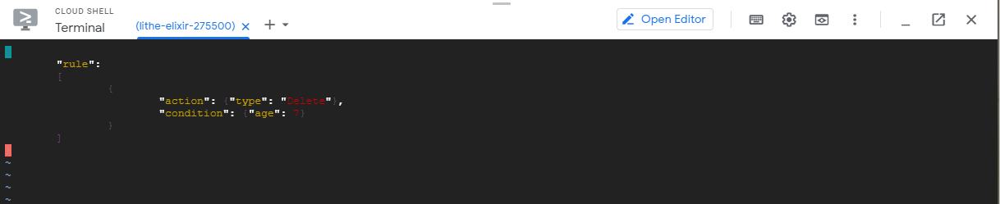

## Storage Buckets in Google Cloud

I created storage buckets in GCP in various ways.

First cloud (created via GCP Console):  
  
 
Second cloud (created via Cloud Shell):  
  
 
Third cloud (created via Cloud Shell and using the CLI to transfer data from the first cloud. Also set a rule to auto-delete after 7 days):  
  
   
  
 
  
